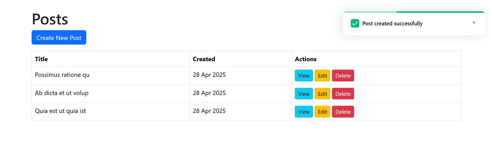

# Laravel Toaster Magic
## 🚀 Installation
##Install the package using Composer: composer require devrabiul/laravel-toaster-magic
##Next, publish the package resources: php artisan vendor:publish --provider="Devrabiul\ToastMagic\ToastMagicServiceProvider"

## 🚀 Blade Integration
Add the following lines to your Blade template:
<!DOCTYPE html>
<html lang="en">
<head>
    <meta charset="UTF-8">
    <meta name="viewport" content="width=device-width, initial-scale=1.0">
    <title>Page</title>
    {!! ToastMagic::styles() !!}
</head>
<body>
    <!-- Your Content -->
    {!! ToastMagic::scripts() !!}
</body>
</html>

## 🚀 Triggering Toasts in Controllers

use Devrabiul\ToastMagic\Facades\ToastMagic;
class TeamController extends Controller
{
    public function store()
    {
        // Your logic here
        ToastMagic::success('Team added successfully!');
        return redirect("/teams");
    }
}
## 🚀 Available toast types: success(),error(),warning(),info()

## 🚀 Triggering Toasts in JavaScript
const toast = new ToastMagic();

// Show a success toast
toast.success("Success!", "Your data has been saved!");

Developed by @devrabiul
